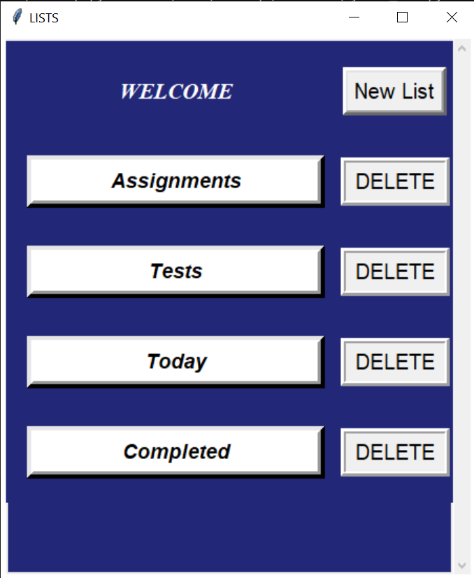
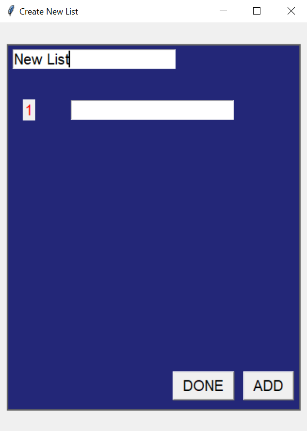
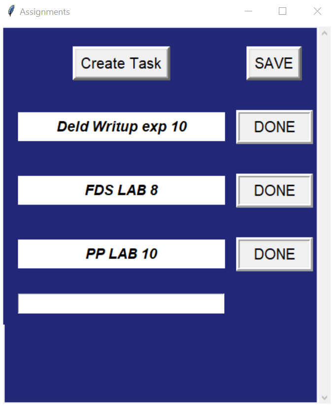
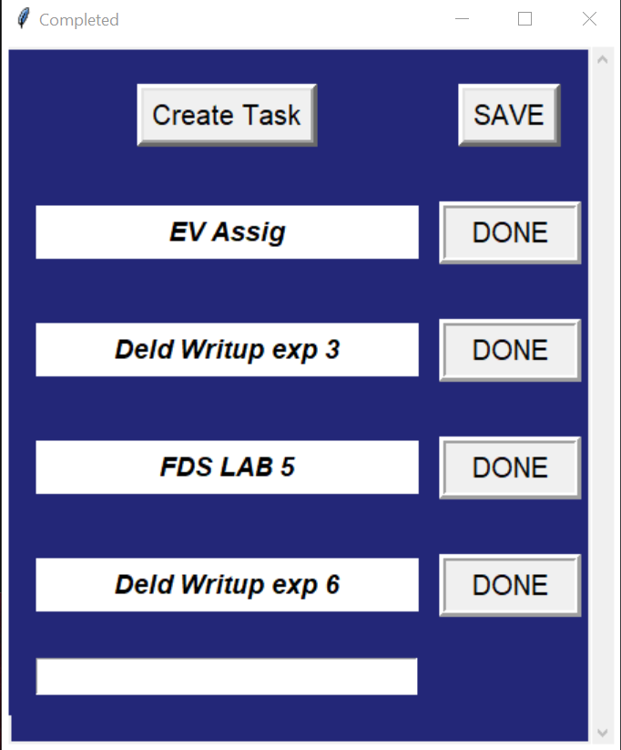
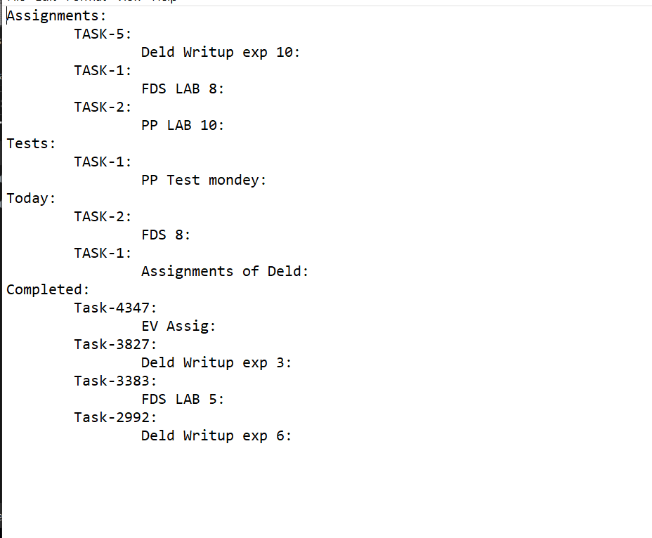

# To-Do-List

 

### Description
***

Many times it happens that while attending lectures or even in general
we come across many Tasks to do ,In such case's this application comes in handy
Just create a bat file of this program , we can use this just like other Applications

  

### Features 
***

* The Data is not lost even if the Program is Stopped or the device is off, as it 
maintains its own Database who's path can be give by the user
    ~~~python
      
      File="Enter the File path here (.txt )"
    
    ~~~
 
* Ones your Task is completed You could Remove that by pressing Done
. All your Completed tasks are not Competently Removed but could be Seen 
on the dashboard under the section ***COMPLETED***.

 

### Preview
***

#### Main Window

<table>
<tr>
<th>

</th>
<th>

In this section we can 
add new list or delete 
the unwanted List.
Except  "***Completed***"  section every other list can be deleted

</th>
</tr>
</table>

#### Creating New List

<table>
<tr>
<th>

</th>
<th>

This section is about creating New List .Ones all the tasks have been added
Enter ***Done*** and the new list would be created.

</th>
</tr>
</table>

#### Particular List

<table>
<tr>
<th>

</th>
<th>

This is the section where we can add all our Tasks .And one's
completed we can remove it using ***Done*** Button.

</th>
</tr>
</table>

#### Completed Tasks

<table>
<tr>
<th>

</th>
<th>

All your completed tasks are Stored here.
If the List itself is deleted then it is not stored here.
 

</th>
</tr>
</table>

#### Database

<table>
<tr>
<th>

</th>
<th>

In the Backend all of our data is stored here in 
a text format.
If data is directly deleted from the database it cannot be restored.

</th>
</tr>
</table>

